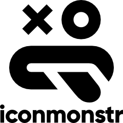

# [Iconmonstr](https://iconmonstr.com/)  

Free icon repository. Icons can be used without attribution.

## Detailed description

Iconmonstr is a free, monstrously big and continuously growing source of simple icons.

### Features
- **Exclusive**: Unique and uniform icons from an exclusive source.
- **Fill & Outline**: Available in every release as fill and outline version.
- **Variations**: A large collection of different design variations.
- **Pixel Precise**: Clean and precise icon design on a 24-pixel grid.
- **Lightweight**: Smart compressed and best optimized for web use.
- **Multiple Formats**: The right format for every app. SVG and PNG.
- **HTML Snippets**: Embed SVG as inline or Base64 within seconds.
- **Favorites**: Best place to store your favorite icons.
- **Icon Generator**: Choose your size, color and background shape.
- **Iconic Font**: Get 300+ free icons in one iconic font.

## Additional details

- Licensing scheme(s): Free without attribution
- Tested by: UAH (Elisa)

## References

- Iconmonstr website: [Iconmonstr](https://iconmonstr.com/)

## See also...

- [Iconmonstr creation issue](https://github.com/e-CLOSE/Toolbox/issues/178)
- Links to related resources:
  - [All resources in the 'icon' category](https://github.com/e-CLOSE/Toolbox/issues?q=label%3A02_RESOURCE+label%3Aicon)
