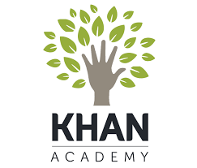

# [Khan Academy](https://www.khanacademy.org/)  

Our mission is to provide a free, world-class education to anyone, anywhere.

## Detailed description

Khan Academy is a non-profit educational organization created in 2008 by Sal Khan. Khan Academy's website aims to provide a free personalized learning experience, that are built on the videos, hosted on YouTube. 
Its website also includes supplementary practice exercises and materials for educators. It has produced over 8,000 video lessons teaching a wide spectrum of academic subjects. All resources are available for free to users of the website and application.
- **Personalized learning:**
Students practice at their own pace, first filling in gaps in their understanding and then accelerating their learning.

- **Trusted content:**
Created by experts, Khan Academy’s library of trusted practice and lessons covers math, science, and more. Always free for learners and teachers.

- **Tools to empower teachers:**
With Khan Academy, teachers can identify gaps in their students’ understanding, tailor instruction, and meet the needs of every student.

## Additional details

- Licensing scheme(s): Free
- Tested by: TUL (Gertruda)

## References

- Khan Academy website: [Khan Academy](https://www.khanacademy.org/)
- [Salman Khan TED Talk 2011 (from ted.com)](https://www.youtube.com/watch?v=gM95HHI4gLk)

## See also...

- [Khan Academy creation issue](https://github.com/e-CLOSE/Toolbox/issues/190)
- Links to related resources:
  - [All resources in the 'video' category](https://github.com/e-CLOSE/Toolbox/issues?q=label%3A02_RESOURCE+label%3Avideo)
