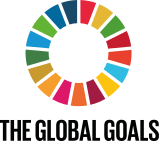

# [SDG](https://www.globalgoals.org/resources)   

Resources related with the global goals (Sustainable Development Goals).

## Detailed description

Here you can find media content and graphical assets for communicating the Global Goals from the United Nations.

Features:

- ICON GRID: Download the full grid with all icons, in png and vector formats.
- THE LOGOTYPE: Download The Global Goals logotypes in png and vector formats.
- UN75 LOGO: Download the latest and official UN7.
- MY ACTIVIST DIARY TOOLKIT: See how you can create your own activist diary.
- CLIMATE ACTION ASSETS PACK: Download the logo in png and vector formats.
- TARGET MEDIA CARDS: Let a target stand out. Perfect for sharing in social media. Includes all of the 169 targets.
- LEAVE NO ONE BEHIND: Download the logo in png and vector formats. The download also includes the Leave No One Behind brand manual.
- BRAND GUIDELINES: Download the official UN brand guidelines containing specs for how to use the logotype, typeface, colors, etc.

## Additional details

- Licensing scheme(s): Free
- Tested by: UAH (Soraya)
- Comments: N/A

## References (links, howtos, tutorials, bibliography, sites, etc.)

This section should include additional references and links to help in
understanding and using the resource.

- SDG website: [SDG](https://www.globalgoals.org/resources)

## See also...

- [SDG creation issue](https://github.com/e-CLOSE/Toolbox/issues/196)
- Links to related resources:

  - [All tools in the 'image' category](https://github.com/e-CLOSE/Toolbox/issues?q=label%3A02_RESOURCE+label%3Aimage)
  - [All tools in the 'video' category](https://github.com/e-CLOSE/Toolbox/issues?q=label%3A02_RESOURCE+label%3Avideo)
