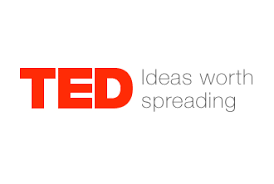

# [TED](https://www.ted.com/)   

TED is a nonprofit devoted to spreading ideas, usually in the form of short, powerful talks (18 minutes or less). TED began in 1984 as a conference where Technology, Entertainment and Design converged, and today covers almost all topics — from science to business to global issues — in more than 100 languages. Meanwhile, independently run TEDx events help share ideas in communities around the world.

## Detailed description

**TED** is a nonprofit devoted to spreading ideas, usually in the form of short, powerful talks (18 minutes or less). TED began in 1984 as a conference where Technology, Entertainment and Design converged, and today covers almost all topics — from science to business to global issues — in more than 100 languages. Meanwhile, independently run TEDx events help share ideas in communities around the world.

Everything TED does is driven by the goal: How can we best spread great ideas? — from Conferences to TED Talks to the projects sparked by The Audacious Project, from the global TEDx and TED Translators communities to the TED-Ed lesson series.

Particularly interesting for teachers is [TED-Ed](https://ed.ted.com/educator): 

**TED-Ed** —aims to spark and celebrate the ideas and knowledge-sharing of teachers and students around the world. TED-Ed supports learning providing an international platform for teachers to create their own interactive lesson plans, helping curious students around the globe bring TED to their schools and gain presentation literacy skills, or celebrating innovative leadership within TED-Ed’s global network of over 250,000 teachers. 

TED-Ed Originals are short, award-winning animated videos about ideas and research that spark the curiosity of learners everywhere. But you can also choose any YouTube video to create a video-based lesson to promote further research. In this (TED-Ed Lessons) is easy customize videos including questions for your students, dig deeper (additional resources to explore), open discussions and you can download the answers of the students to motivate them or to evaluate.

## Additional details

- Licensing scheme(s): Free
- Tested by: UAH (Rosa)

## References

- TED website: [TED](https://www.ted.com/)
- [TED & TEDx Explained](https://www.youtube.com/watch?v=d0NHOpeczUU)
- TED-Ed website: [TED-Ed](https://ed.ted.com/educator)
- [About TED-Ed](https://ed.ted.com/about)

## See also...

- [TED creation issue](https://github.com/e-CLOSE/Toolbox/issues/189)
- Links to related resources:
  - [All resources in the 'video' category](https://github.com/e-CLOSE/Toolbox/issues?q=label%3A02_RESOURCE+label%3Avideo)
  - [All resources in the 'podcast' category](https://github.com/e-CLOSE/Toolbox/issues?q=label%3A02_RESOURCE+label%3Apodcast)
