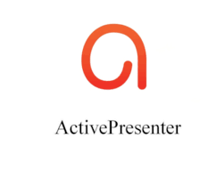

# [ActivePresenter](https://atomisystems.com/activepresenter/)   

Record screen, create demos, tutorials, training videos, and interactive HTML5 elearning contents.

## Detailed description & quick guide

ActivePresenter is one of the most powerful and easy to use screencasting and video editors. It can be used to create software demonstrations, software simulations, and quizzes. It allows exporting to a series of images, HTML slideshows, documents (PDF, Microsoft Word, Excel), Microsoft PowerPoint presentations, videos (AVI, MP4, WMV, WebM), Flash videos and interactive simulations (HTML5, Adobe Flash).

ActivePresenter has been developed by Atomi Systems Inc. since 2007.

## Additional details

- Subscription mode: Freemium. Three editions are available (Free, Standard and Pro)
- Platform: Windows, MacOS
- Tested by: UAH (Rosa)
- Comments: Features: screem recording, audio and video editing, software simulation, eLearning games, Quiz Building, etc.

## References

- ActivePresenter website: [ActivePresenter](https://atomisystems.com/activepresenter/)
- ActivePresenter Tutorials: [Help & Tutorials](https://atomisystems.com/tutorials/)
- ActivePresenter Manuals: [Getting Started with ActivePresenter 8](https://atomisystems.com/activepresenter/tutorials/)
- Elearning examples: [Demos](https://atomisystems.com/activepresenter/demo/)

## See also...

- [ActivePresenter creation issue](https://github.com/e-CLOSE/Toolbox/issues/91)
- Links to similar tools:
  - [All tools in the 'design' category](https://github.com/e-CLOSE/Toolbox/issues?q=label%3A01_TOOL+label%3Adesign)
  - [All tools in the 'video' category](https://github.com/e-CLOSE/Toolbox/issues?q=label%3A01_TOOL+label%3Avideo)
