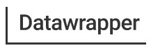

# [Datawrapper](https://www.datawrapper.de/)    

Data visualization tool capable of showing data in beautiful charts, maps or tables with a few clicks.

# Detailed description & quick guide

Datawrapper lets you show your data as charts, maps or tables with a few clicks. Find out more about all the available visualization types.

## Characteristics:

Charts: Use one of 20 interactive and responsive chart types ranging from simple bars and lines to arrow, range and scatter plots.

Maps: Three interactive & responsive map types let you create anything from locator maps to thematic choropleth & symbol maps. 
  
  - Choropleth map: Color regions to show data like unemployment rates or election results on a map. Upload your own map or use any of our more than 2000 maps.                       The resulting map is responsive & interactive.
  - Symbol map: Create symbols sized and colored according to your data. Works great for specific locations (like cities). Upload your own map or use any of our                 more than 2000 maps. The resulting map is responsive & interactive.
  - Locator map: Add markers to a map to show where something is located or happened, e.g. events within a city. Perfect for showing readers the places you                        mention in an article. The resulting map is responsive and static.

Tables: Responsive data tables allow for lots of styling options and let you include bar, column & line charts, heatmaps, images, a search bar and pagination.

## Additional details

- Subscription mode: Company account (Datawrapper)
- Platform: Web
- Tested by: UAH (Amelio); UAH()
- Comments: Web based application to create high-quality data graphics and animations from raw data files.

## References

- Datawrapper website: [Datawrapper](https://www.datawrapper.de/)
- Datawrapper Welcome! [Datawrapper](https://academy.datawrapper.de/category/141-general)
- Datawrapper Blog [Datawrapper](https://blog.datawrapper.de/)

## See also...

- [Datawrapper creation issue](https://github.com/e-CLOSE/Toolbox/issues/132)
- Links to similar tools:
  - [All tools in the 'visualization' category](https://github.com/e-CLOSE/Toolbox/issues?q=label%3A01_TOOL+label%3Avisualization)
  - [All tools in the 'diagrams' category](https://github.com/e-CLOSE/Toolbox/issues?q=label%3A01_TOOL+label%3Adiagrams)
  - [All tools in the 'graphics' category](https://github.com/e-CLOSE/Toolbox/issues?q=label%3A01_TOOL+label%3Agraphics)
