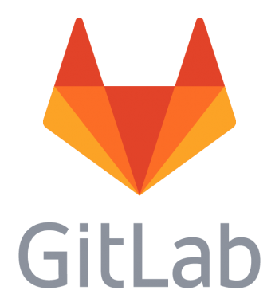

# [GitLab](https://gitlab.com/ )   

Collaborative development platform that hosts projects using the git revision control system .

## Detailed description & quick guide

GitLab is The DevOps Platform that empowers organizations to maximize the overall return on software development by delivering software faster and efficiently, while strengthening security and compliance. With GitLab, every team in your organization can collaboratively plan, build, secure, and deploy software to drive business outcomes faster with complete transparency, consistency and traceability. Moreover, GitLab helps teams manage and optimize their software delivery lifecycle with metrics and value stream insight in order to streamline and increase their delivery velocity by providing different features:

- Regardless of your process, GitLab provides powerful planning tools to keep everyone synchronized.
- Create, view, and manage code and project data through powerful branching tools.
- Verification by keeping strict quality standards for production code with automatic testing and reporting.
- Create a consistent and dependable software supply chain with built-in package management.
- Security capabilities, integrated into your development lifecycle.
- GitLab's integrated CD solution allows you to ship code with zero-touch, be it on one or one thousand servers.
- Configure your applications and infrastructure.
- Help reduce the severity and frequency of incidents.
- Protect your apps and infrastructure from security intrusions.

## Additional details

- Subscription mode: Freemium
- Platform: Web
- Tested by: UAH (Elisa)
- Comments: Web based source management (version control based on git & more). Free access allows unlimited public repositories with full features, and unlimited private repositories with a limited feature set.

## References

- GitLab website: [GitLab](https://gitlab.com/)

## See also...

- [GitLab creation issue](https://github.com/e-CLOSE/Toolbox/issues/142)
- Links to similar tools:
  - [All tools in the 'project' category](https://github.com/e-CLOSE/Toolbox/issues?q=label%3A01_TOOL+label%3Aproject)
  - [All tools in the 'collaboration' category](https://github.com/e-CLOSE/Toolbox/issues?q=label%3A01_TOOL+label%3Acollaboration)
