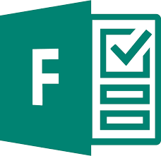

# [Microsoft Forms](https://forms.office.com/)     

Application for creating shareable surveys, quizzes and polls.

## Detailed description & quick guide

Microsoft Forms is a powerful business tool that allows you to easily create forms and collect real-time responses from collaborators and colleagues.
Once you begin using Microsoft Forms, you’ll find it easy to visualize data through the automatic charting function. There are many great uses for this innovative tool such as gauging satisfaction, gathering feedback, and making better decisions based on actual data.

## Additional details

- Microsoft Forms is typically used to collect survey data and user responses. 
- Use it as a tool to survey employees, gather feedback and even ask for advice on projects and other key decisions. 
- Use it to share quizzes, surveys and similar documents.
- Another great benefit of the tool is visualized data. Form data is automatically converted into charts and graphs that make your data more functional and easy to interpret.
- Subscription mode: Company account (Microsoft/Outlook)
- Platform: Web
- Tested by: UAH (Elisa); UA (Romeu); UA (Paulo); HTW (Xenia); UA(Margarida); UAH (Javi)
- Comments: Easy form generation, sharing and results collection

## References (links, howtos, tutorials, bibliography, sites, etc.)

This section should include additional references and links to help in
understanding and using the tool.

- Microsoft Forms website: [Microsoft Forms](https://forms.office.com/)

## See also...

- [Microsoft Forms creation issue](https://github.com/e-CLOSE/Toolbox/issues/119)
- Links to similar tools:
  - [All tools in the 'feedback' category](https://github.com/e-CLOSE/Toolbox/issues?q=label%3A01_TOOL+label%3Afeedback)
  - [All tools in the 'evaluation' category](https://github.com/e-CLOSE/Toolbox/issues?q=label%3A01_TOOL+label%3Aevaluation)
  - [All tools in the 'gamification' category](https://github.com/e-CLOSE/Toolbox/issues?q=label%3A01_TOOL+label%3Agamification)
  - [All tools in the 'collaboration' category](https://github.com/e-CLOSE/Toolbox/issues?q=label%3A01_TOOL+label%3Acollaboration)
