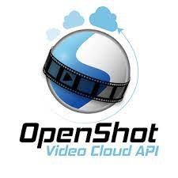

# [OpenShot](https://www.openshot.org/)   

Video editor.

## Detailed description & quick guide

OpenShot Video Editor is a free and open-source video editor for Windows, macOS, Linux, and Chrome OS. The project started in August 2008 by Jonathan Thomas, with the objective of providing a stable, free, and friendly to use video editor.

OpenShot supports commonly used video compression formats that are supported by FFmpeg, including WebM (VP9), AVCHD (libx264), HEVC (libx265), and audio codecs such as mp3 (libmp3lame) and aac (libfaac). The program can render MPEG4, ogv, Blu-ray, and DVD video, and Full HD videos for uploading to Internet video web sites.[13]

### Features

- Cross-platform video editing software (Linux, macOS, Windows and Chrome OS).
- Support for many video, audio, and image formats using the FFmpeg library. For a full list of supported formats, see the FFmpeg project.
- Powerful curve-based Key frame animations. The key frames interpolation mode can be quadratic bezier curves, linear, or constant, which determines how the animated values are calculated.
- Desktop integration (drag and drop support, native file browsers, window borders).
- Unlimited tracks / layers Tracks are used to layer images, videos, and audio in a project. Any transparency will show through the layer below it. Tracks can also be moved up, down, or locked.
- Clip resizing, scaling, trimming, snapping, rotation, cutting, alpha, and adjusting X,Y location.
- Video transitions with real-time previews. The quickness and sharpness of the transitions can also be adjusted using keyframes (if needed). Overlapping two clips will create a new transition automatically.
- Compositing, image overlays, watermarks When arranging clips in a video project, images on the higher tracks/layers will be displayed on top, and the lower tracks will be displayed behind them. Much like a stack of paper, items on top cover up items below them. And if you cut any holes out (i.e. transparency) the lower images will show though.
- Title templates, title creation, sub-titles
- 3D animated titles (and effects) using Blender.
- Advanced Timeline, with features including: Drag & drop, scrolling, alignment, panning, zooming, slicing, preset animation and settings, etc.
- Frame accuracy (step through each frame of video) with keyboard support
- Time-mapping and speed changes on clips (slow/fast, forward/backward, etc...)
- Audio mixing and editing features, such as displaying waveforms on the timeline, or even rendering the waveform as part of your video. You can also split the audio from your video clip, and adjust each audio channel individually.
- Digital video effects, including brightness, gamma, hue, greyscale, chroma key (bluescreen / greenscreen)

## Additional details

- Subscription mode: Free
- Platform: GNU/Linux, MacOS, Windows
- Tested by: UAH (Elisa); UA (Paulo); UAH (Rosa)

## References

- OpenShot website: [OpenShot](https://www.openshot.org/)

## See also...

- [OpenShot creation issue](https://github.com/e-CLOSE/Toolbox/issues/88)
- Links to similar tools:
  - [All tools in the 'design' category](https://github.com/e-CLOSE/Toolbox/issues?q=label%3A01_TOOL+label%3Adesign)
  - [All tools in the 'video' category](https://github.com/e-CLOSE/Toolbox/issues?q=label%3A01_TOOL+label%3Avideo)
