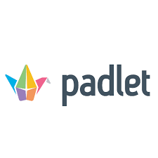

# [Padlet](https://padlet.com/)      

Collaborative online tool that allows posting text, images, links, documents, videos and voice recordings.

## Detailed description & quick guide

Padlet is a digital tool that allows teachers and learners to collaborate online by posting text, images, links, documents, videos and voice recordings. With these features, it can help teachers and students in class and beyond by offering a single place for a notice board. 
This digital notice board works as a "wall" that can be made public or private. Thus, teachers and students can post on the wall any information they want.
Since the interactive space is easy to use and easily accessible from nearly any web browser-capable device, it's a great resource for the teaching and learning process.

## Additional details

- Subscription mode: Freemium
- Platform: Web, iOS, Android
- Tested by: UAH (Elisa, Soraya); UA (Romeu); UA (Paulo); HTW (Xenia); UA(Margarida); TUL (Gertruda)

## References (links, howtos, tutorials, bibliography, sites, etc.)

- Padlet website: [Padlet](https://padlet.com/)

## See also...

- [Padlet creation issue](https://github.com/e-CLOSE/Toolbox/issues/150)
- Links to similar tools:
  - [All tools in the 'diagrams' category](https://github.com/e-CLOSE/Toolbox/issues?q=label%3A01_TOOL+label%3Adiagrams)
  - [All tools in the 'collaboration' category](https://github.com/e-CLOSE/Toolbox/issues?q=label%3A01_TOOL+label%3Acollaboration)
  - [All tools in the 'feedback' category](https://github.com/e-CLOSE/Toolbox/issues?q=label%3A01_TOOL+label%3Afeedback)
  - [All tools in the 'project' category](https://github.com/e-CLOSE/Toolbox/issues?q=label%3A01_TOOL+label%3Aproject)
  - [All tools in the 'communication' category](https://github.com/e-CLOSE/Toolbox/issues?q=label%3A01_TOOL+label%3Acommunication)
