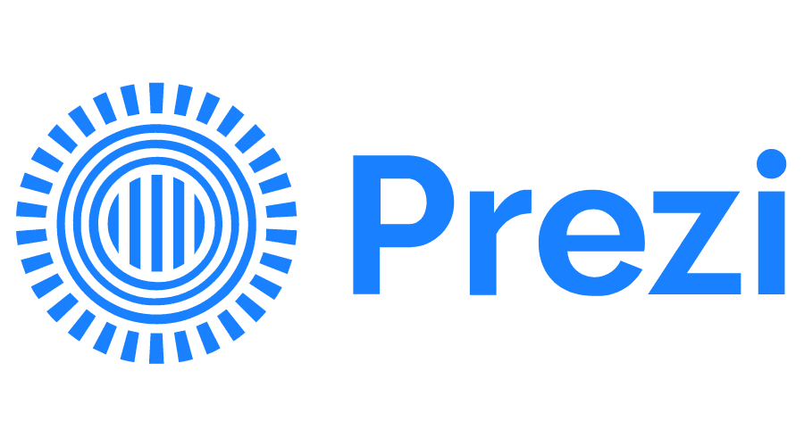

# [Prezi](https://prezi.com/)     

Web-based tool that allows users to create a presentation using a map layout.

## Detailed description & quick guide

Prezi is a Hungarian video and visual communications software company. The word "Prezi" is the short form of "presentation" in Hungarian. It is a visual storytelling software alternative to traditional slide-based presentation formats. Prezi presentations feature a map-like overview that lets users pan between topics, zoom in on details, and pull back to reveal context. Prezi Video is integrated with popular video chat platforms and communication tools; it can be used in Zoom, Microsoft Teams, Google Hangouts, Slack, Facebook, GoToWebinar and Webex.

## Additional details

- Subscription mode: Free/Paid
- Platform: Web
- Tested by: TUL (Gertruda); UA (Romeu); UAH (Elisa); UAH (Rosa)

## References

- Prezi website: [Prezi](https://prezi.com/)
- [Prezi support](https://support.prezi.com/hc/en-us)
- [Tips and Trics](https://www.hongkiat.com/blog/prezi-tips-tricks/)
- [Prezi helpdesk](https://www.liveagent.com/directory/prezi-help-desk-contacts/)

## See also...

- [Prezi creation issue](https://github.com/e-CLOSE/Toolbox/issues/155)
- Links to similar tools:
  - [All tools in the 'design' category](https://github.com/e-CLOSE/Toolbox/issues?q=label%3A01_TOOL+label%3Adesign)
  - [All tools in the 'graphics' category](https://github.com/e-CLOSE/Toolbox/issues?q=label%3A01_TOOL+label%3Agraphics)
  - [All tools in the 'video' category](https://github.com/e-CLOSE/Toolbox/issues?q=label%3A01_TOOL+label%3Avideo)
  - [All tools in the 'presentations' category](https://github.com/e-CLOSE/Toolbox/issues?q=label%3A01_TOOL+label%3Apresentations)
