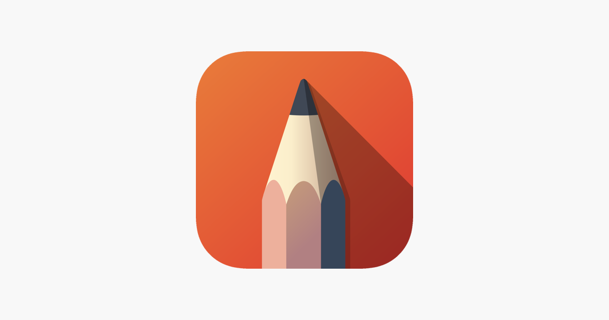

# [Sketchbook](https://www.autodesk.com/products/sketchbook/overview)    

Painting and drawing app.

## Detailed description & quick guide

Sketchbook (formerly StudioPaint, Autodesk SketchBook), is a raster graphics software app intended for expressive drawing and concept sketching also for making animations (Jelly Boo, Teatralka). The software was first developed by Alias Systems Corporation as StudioPaint, before being acquired by Autodesk and then being spun out into an independent company, Sketchbook, Inc. Originally developed as commercial software, it evolved into a subscription model before eventually being made freeware for personal use. In 2021, Sketchbook Pro, the desktop version of the app available on Microsoft Windows and macOS, became a paid software available through the Microsoft Store and Mac App Store.

Sketchbook features a radial/pie-menu user interface and has painting and drawing tools such as pencils, markers, and brushes. It uses pressure-sensitive features of digital drawing pads, tablet computers, and smartphones to create effects similar to traditional materials. A screenshot tool is also included for annotations, allowing one to show content during meetings, and to add notes for review. The program can also create flipbooks or animations, and it supports layers with the ability to import from and export to Adobe Photoshop (.psd) format. Other features include rulers, brush customization, and canvas rotation.

## Additional details

- Subscription mode: Free / Paid
- Platform: MacOS, Windows, iOS, Android
- Tested by: UA (Paulo)
- Comments: Free for iOS and Andoid, paid for MacOS and Windows

## References (links, howtos, tutorials, bibliography, sites, etc.)

- Sketchbook website: [Sketchbook](https://www.autodesk.com/products/sketchbook/overview)

## See also...

- [Sketchbook creation issue](https://github.com/e-CLOSE/Toolbox/issues/158)
- Links to similar tools:
  - [All tools in the 'whiteboard' category](https://github.com/e-CLOSE/Toolbox/issues?q=label%3A01_TOOL+label%3Awhiteboard)
  - [All tools in the 'diagrams' category](https://github.com/e-CLOSE/Toolbox/issues?q=label%3A01_TOOL+label%3Adiagrams)
  - [All tools in the 'design' category](https://github.com/e-CLOSE/Toolbox/issues?q=label%3A01_TOOL+label%3Adesign)
