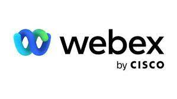

# [WebEx](https://www.webex.com)       

Platform for instant messaging, audio and video calls, online meetings, file and data sharing.

## Detailed description & quick guide
Cisco Webex is a cloud-based collaboration suite for video conferencing and collaborative work. This suite comprise different software tools, namely Webex Meetings, Webex Teams and Webex Devices, and merges the web conferencing platform and the Spark team collaboration tool from Cisco.
The tools included in the Cisco Webex suite provide capabilities including online meetings, team messaging and file sharing. These features are important for collaboration work and allow to have a unified communications plataform adequate both for small as well as large group meetings.
Users can join video conferences from a desktop or mobile app. A web version of Webex is available as well, although more features are available on the other versions. Users can also share files and participate in team messaging features. The service is supported by both Cisco Webex Meetings and Webex Teams apps.

## Additional details

- Subscription mode: Only paid
- Platform: Web, MacOS, Windows, iOS, Android
- Tested by: UAH (Elisa); UA (Romeu)
- Comments: N/A

## References (links, howtos, tutorials, bibliography, sites, etc.)

This section should include additional references and links to help in
understanding and using the tool.

- WebEx website: [WebEx](https://www.webex.com)

## See also...

- [WebEx creation issue](https://github.com/e-CLOSE/Toolbox/issues/167)
- Links to similar tools:
  - [All tools in the 'communication' category](https://github.com/e-CLOSE/Toolbox/issues?q=label%3A01_TOOL+label%3Acommunication)
  - [All tools in the 'collaboration' category](https://github.com/e-CLOSE/Toolbox/issues?q=label%3A01_TOOL+label%3Acollaboration)
  - [All tools in the 'streaming' category](https://github.com/e-CLOSE/Toolbox/issues?q=label%3A01_TOOL+label%3Astreaming)
  - [All tools in the 'whiteboard' category](https://github.com/e-CLOSE/Toolbox/issues?q=label%3A01_TOOL+label%3Awhiteboard)
  - [All tools in the 'video' category](https://github.com/e-CLOSE/Toolbox/issues?q=label%3A01_TOOL+label%3Avideo)
  - [All tools in the 'organization' category](https://github.com/e-CLOSE/Toolbox/issues?q=label%3A01_TOOL+label%3Aorganization)
