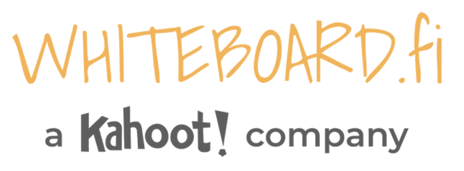

# [Xournal++](https://github.com/xournalpp/xournalpp)  

Powerful and multiplatform whiteboard/blackboard __SHORT_DESC__ note taking app .

## Detailed description & quick guide

This section should include a detailed description of the tool.

## Additional details

- Subscription mode: Completely free GPL v2
- Platform: GNU/Linux, MacOS, Windows
- Tested by: UAH (Javi)
- Comments: Hand note-taking software that is perfectly suited as a virtual blackboard, supporting drawing on top of pdf files. Simple and comfortable interface.

## References (links, howtos, tutorials, bibliography, sites, etc.)

This section should include additional references and links to help in
understanding and using the tool.

- Xournal++ website: [Xournal++](https://github.com/xournalpp/xournalpp)

## See also...

- [Xournal++ creation issue](https://github.com/e-CLOSE/Toolbox/issues/70)
- Links to similar tools:
  - [All tools with the same set of categories](https://github.com/e-CLOSE/Toolbox/issues?q=label%3A01_TOOL+label%3Awhiteboard)
  - [All tools in the 'whiteboard' category](https://github.com/e-CLOSE/Toolbox/issues?q=label%3A01_TOOL+label%3Awhiteboard)
