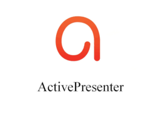

# [FOR DELETE](https://atomisystems.com/activepresenter/)   

Record screen, create demos, tutorials, training videos, and interactive HTML5 elearning contents.

## Detailed description & quick guide

ActivePresenter is one of the most powerful and easy to use screencasting and video editors. It can be used to create software demonstrations, software simulations, and quizzes. It allows exporting to a series of images, HTML slideshows, documents (PDF, Microsoft Word, Excel), Microsoft PowerPoint presentations, videos (AVI, MP4, WMV, WebM), Flash videos and interactive simulations (HTML5, Adobe Flash).
