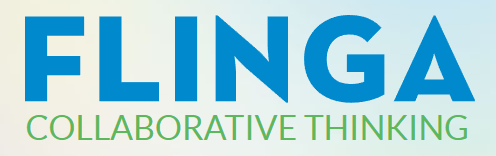

# [flinga](https://flinga.fi/)   

Collaborative white board.

## Detailed description & quick guide

Flinga Whiteboard
- creating content together

Flinga Wall
- creating ideas together

Flinga is simple to use and has only a few functions. For a fast, easy and mostly barrier-free collection of ideas it is perfect.

## Additional details

- Subscription mode: Free
- Tested by: Xenia (HTW)
- Comments: Finnish Platform

## References

- flinga website: [flinga](https://flinga.fi/)

## See also...

- [flinga creation issue](https://github.com/e-CLOSE/Toolbox/issues/170)
- Links to similar tools:
  - [All tools in the 'whiteboard' category](https://github.com/e-CLOSE/Toolbox/issues?q=label%3A01_TOOL+label%3Awhiteboard)
  - [All tools in the 'collaboration' category](https://github.com/e-CLOSE/Toolbox/issues?q=label%3A01_TOOL+label%3Acollaboration)
