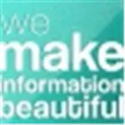

](https://github.com/e-CLOSE/Toolbox/blob/main/Tools/ActivePresenter.md)
](https://github.com/e-CLOSE/Toolbox/blob/main/Tools/Animaker.md)
](https://github.com/e-CLOSE/Toolbox/blob/main/Tools/Audacity.md)
](https://github.com/e-CLOSE/Toolbox/blob/main/Tools/Bitpaper.md)
](https://github.com/e-CLOSE/Toolbox/blob/main/Tools/ClassTools.net.md)
](https://github.com/e-CLOSE/Toolbox/blob/main/Tools/ClickMeeting.md)
](https://github.com/e-CLOSE/Toolbox/blob/main/Tools/Do_ink.md)
](https://github.com/e-CLOSE/Toolbox/blob/main/Tools/Doodly.md)
](https://github.com/e-CLOSE/Toolbox/blob/main/Tools/dotstorming.md)
](https://github.com/e-CLOSE/Toolbox/blob/main/Tools/EclipseCrossword.md)
](https://github.com/e-CLOSE/Toolbox/blob/main/Tools/edpuzzle.md)
](https://github.com/e-CLOSE/Toolbox/blob/main/Tools/Evernote.md)
](https://github.com/e-CLOSE/Toolbox/blob/main/Tools/ExplainEverything.md)
](https://github.com/e-CLOSE/Toolbox/blob/main/Tools/Figma.md)
](https://github.com/e-CLOSE/Toolbox/blob/main/Tools/Flourish.md)
](https://github.com/e-CLOSE/Toolbox/blob/main/Tools/Genially.md)
](https://github.com/e-CLOSE/Toolbox/blob/main/Tools/GeoGebra.md)
](https://github.com/e-CLOSE/Toolbox/blob/main/Tools/GitHub.md)
](https://github.com/e-CLOSE/Toolbox/blob/main/Tools/GitLab.md)
](https://github.com/e-CLOSE/Toolbox/blob/main/Tools/Google_Calendar.md)
](https://github.com/e-CLOSE/Toolbox/blob/main/Tools/infogram.md)
](https://github.com/e-CLOSE/Toolbox/blob/main/Tools/Kahoot.md)
](https://github.com/e-CLOSE/Toolbox/blob/main/Tools/LearningApps.md)
](https://github.com/e-CLOSE/Toolbox/blob/main/Tools/Linoit.md)
](https://github.com/e-CLOSE/Toolbox/blob/main/Tools/Loom.md)
](https://github.com/e-CLOSE/Toolbox/blob/main/Tools/Mentimeter.md)
](https://github.com/e-CLOSE/Toolbox/blob/main/Tools/MindMup.md)
](https://github.com/e-CLOSE/Toolbox/blob/main/Tools/mobbyt.md)
](https://github.com/e-CLOSE/Toolbox/blob/main/Tools/MovieMaker.md)
](https://github.com/e-CLOSE/Toolbox/blob/main/Tools/OneNote.md)
](https://github.com/e-CLOSE/Toolbox/blob/main/Tools/Pear_Deck.md)
](https://github.com/e-CLOSE/Toolbox/blob/main/Tools/PIKTOCHART.md)
](https://github.com/e-CLOSE/Toolbox/blob/main/Tools/Plickers.md)
](https://github.com/e-CLOSE/Toolbox/blob/main/Tools/Poll_Everywhere.md)
](https://github.com/e-CLOSE/Toolbox/blob/main/Tools/Popplet.md)
](https://github.com/e-CLOSE/Toolbox/blob/main/Tools/PosterMyWall.md)
](https://github.com/e-CLOSE/Toolbox/blob/main/Tools/PowToon.md)
](https://github.com/e-CLOSE/Toolbox/blob/main/Tools/QR_Code_Generator.md)
](https://github.com/e-CLOSE/Toolbox/blob/main/Tools/Scrumblr.md)
](https://github.com/e-CLOSE/Toolbox/blob/main/Tools/SimpleMind.md)
](https://github.com/e-CLOSE/Toolbox/blob/main/Tools/Slack.md)
](https://github.com/e-CLOSE/Toolbox/blob/main/Tools/Socrative.md)
](https://github.com/e-CLOSE/Toolbox/blob/main/Tools/Speech_to_Text.md)
](https://github.com/e-CLOSE/Toolbox/blob/main/Tools/StoryboardThat.md)
](https://github.com/e-CLOSE/Toolbox/blob/main/Tools/Streamyard.md)
](https://github.com/e-CLOSE/Toolbox/blob/main/Tools/Talk_Comment.md)
](https://github.com/e-CLOSE/Toolbox/blob/main/Tools/Toonly_Moovly.md)
](https://github.com/e-CLOSE/Toolbox/blob/main/Tools/Toonly_Moovly.md)
](https://github.com/e-CLOSE/Toolbox/blob/main/Tools/Trello.md)
](https://github.com/e-CLOSE/Toolbox/blob/main/Tools/Vcasmo.md)
](https://github.com/e-CLOSE/Toolbox/blob/main/Tools/VideoScribe.md)
](https://github.com/e-CLOSE/Toolbox/blob/main/Tools/WeVideo.md)
](https://github.com/e-CLOSE/Toolbox/blob/main/Tools/wiki_moodle_.md)
](https://github.com/e-CLOSE/Toolbox/blob/main/Tools/Wooclap.md)
](https://github.com/e-CLOSE/Toolbox/blob/main/Tools/Xournal++.md)
