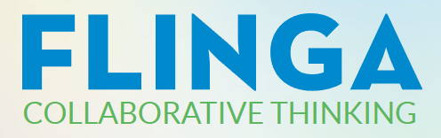
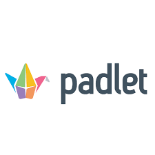
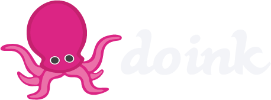
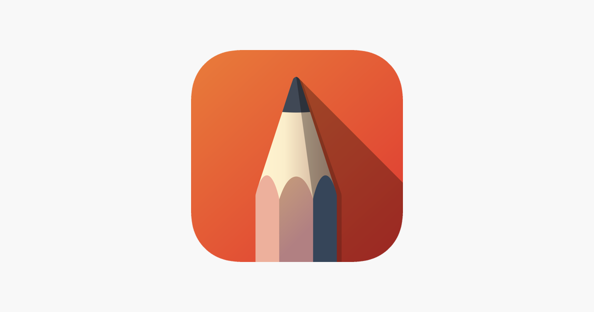
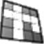

# List of all Tools classified by category

---
## All Tools in category audio

---
## All Tools in category cognitive

---
## All Tools in category collaboration

---
## All Tools in category communication

---
## All Tools in category design

---
## All Tools in category diagrams

---
## All Tools in category dissemination

---
## All Tools in category evaluation

---
## All Tools in category feedback

---
## All Tools in category gamification

---
## All Tools in category graphics

---
## All Tools in category organization

---
## All Tools in category other

---
## All Tools in category presentations

---
## All Tools in category project

---
## All Tools in category streaming

---
## All Tools in category video

---
## All Tools in category visualization

---
## All Tools in category whiteboard

